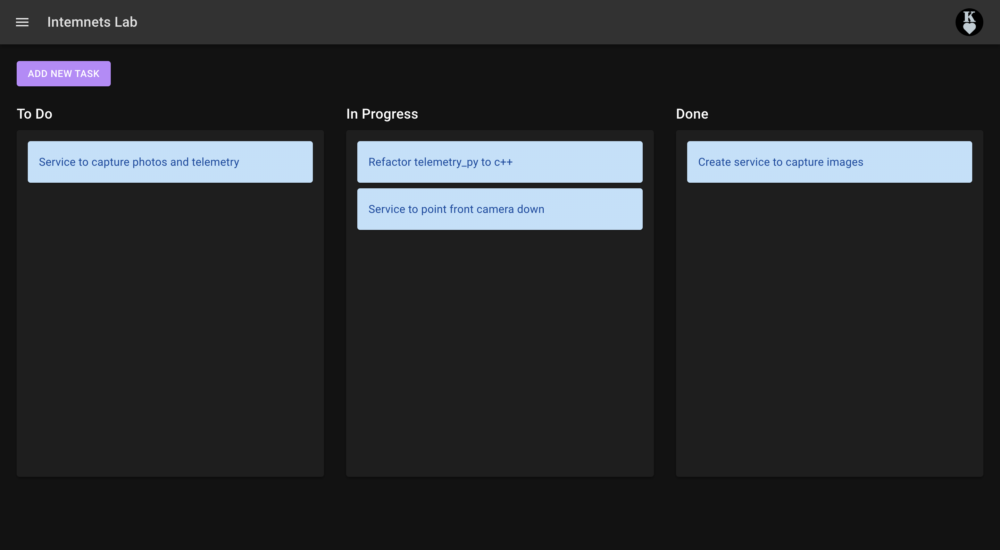
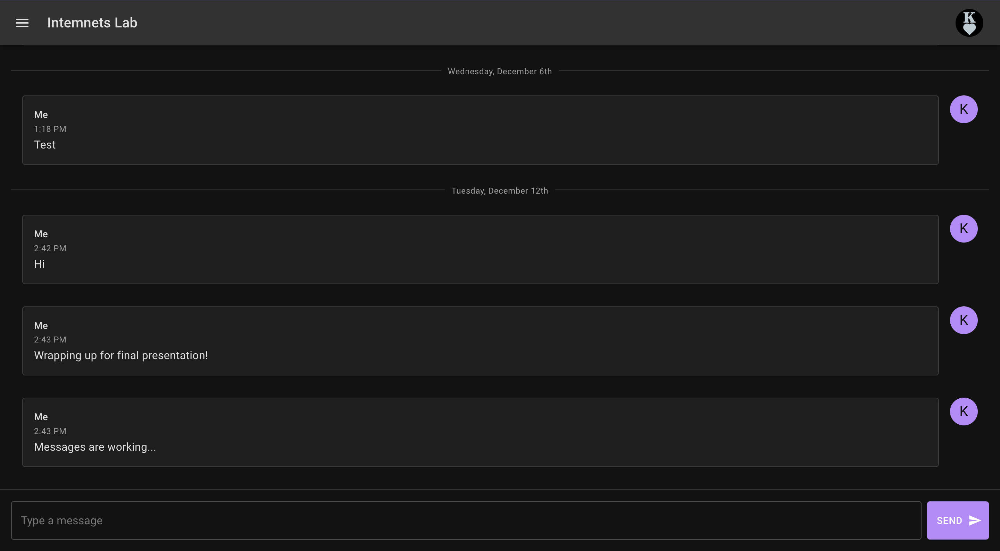
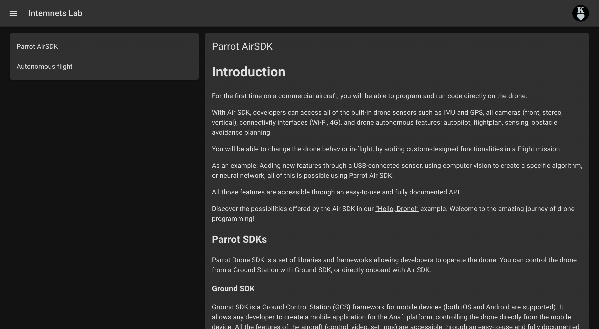
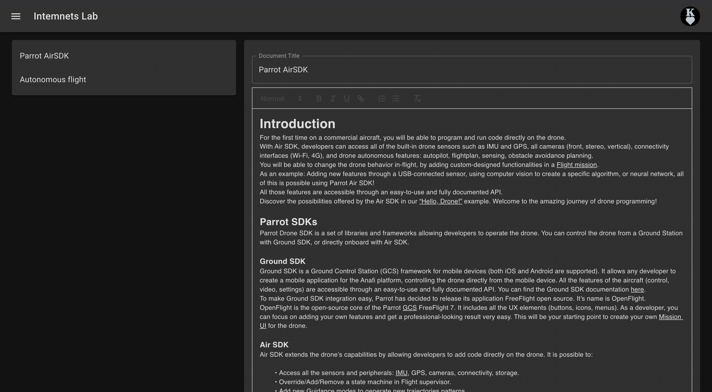
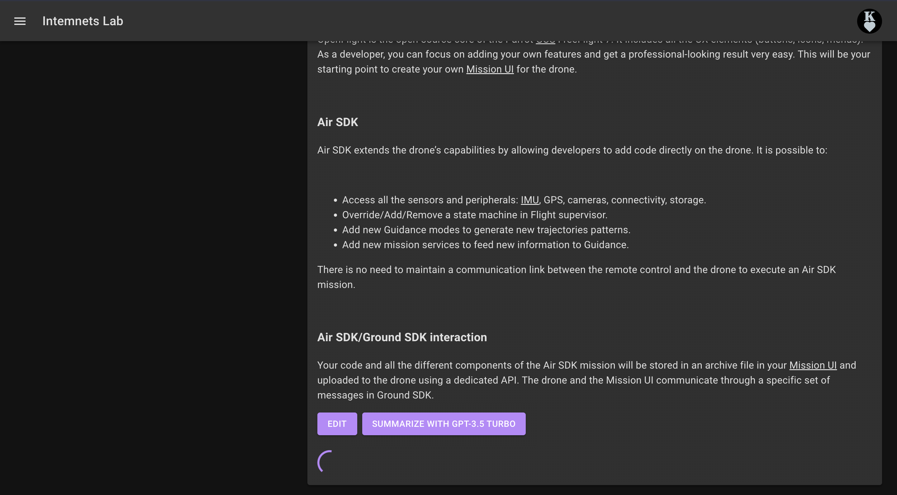
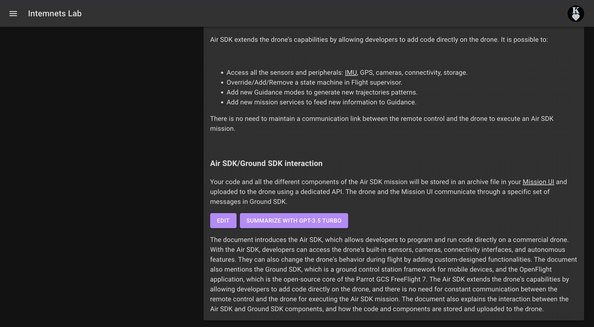

# Research Lab Management Portal

## Project Title
Research Lab Management Web Application

## Deployed URL
[Research Lab Management Portal](https://lab-portal-f239e.web.app/)

## Team and Roles
Fully developed by Kael!

## User Audience and Their Needs
Our user audience consists of undergraduate research labs, specifically research advisors and undergraduate researchers. They need a platform to manage research tasks, facilitate real-time communication, and create, edit, and share project documentation.

## App Demo
**Kanban-style tasks**

**Edit, drag, save tasks**

**Real-time chat**

**Create documentation**

**Edit documentation in rich-text**

**Summarize documents with OpenAI API**

## Technology Highlights
- **APIs Used**: OpenAI API
- **Database Storage**: Tasks, messages, and documents are stored in Firestore.
- **Challenges**: It was challenging to get the OpenAI API to work with the documentation component, but in the process I learned about environment variables and API best practices.

## Future Improvements
- **Implement syntax highlighting and code blocks in documents**
- **Add features to tasks including deadlines, subtasks, assigned users, etc**
- **Add reactions and threads to messaging**

👏🏼👏🏼👏🏼
