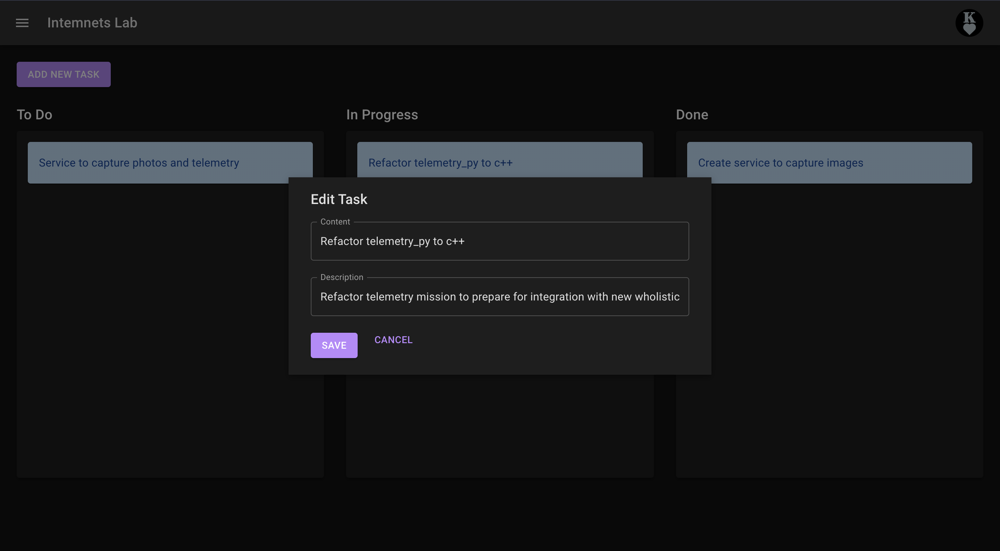

# Research Lab Management Portal

## Project Title
Research Lab Management Web Application

## Deployed URL
[Research Lab Management Portal](https://lab-portal-f239e.web.app/)

## Team and Roles
Fully developed by Kael!

## User Audience and Their Needs
Our user audience consists of undergraduate research labs, specifically research advisors and undergraduate researchers. They need a platform to manage research tasks, facilitate real-time communication, and create, edit, and share project documentation.

## App Demo

## Technology Highlights
- **APIs Used**: Firebase Firestore, Firebase Authentication, OpenAI API
- **Database Storage**: We store tasks, chat messages, and documents in Firestore.
- **Challenges**: It was challenging to get the 

👏🏼👏🏼👏🏼
